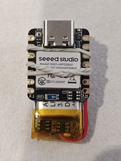

# Shelly BLU Button1 BTHome Beacon Emulator

[Polski](#polski) | [English](#english)

---

## Polski

Emulator beacona BTHome kompatybilny z urządzeniem Shelly BLU Button1. Projekt umożliwia emulację ramek BLE (advertising i scan response) w identycznej postaci bajt po bajcie jak oryginalne urządzenie Shelly, co pozwala na bezproblemową integrację z systemami obsługującymi protokół BTHome, takimi jak Home Assistant czy aplikacja Shelly.

### Funkcjonalności

- **Emulacja 1:1** – ramki BLE są identyczne jak w oryginalnym Shelly BLU Button1.
- **Ekstremalnie niska emisja energii (~93 µA)** – wykorzystanie systemu FreeRTOS (usypianie rdzenia WFE podczas `delay()`), przetwornicy DCDC oraz całkowite wyłączenie nieużywanych peryferiów (NFC, UART, I2C, SPI, pull-upy). Na baterii 200 mAh urządzenie może pracować ok. 90 dni.
- **Monitorowanie baterii** – odczyt napięcia przez wbudowany dzielnik napięcia (SAADC) z nieliniową aproksymacją krzywej rozładowania LiPo. Pomiar odbywa się co 60 sekund w celu oszczędzania energii, a wynik (0–100%) wysyłany jest w każdej ramce.
- **Maksymalna moc nadajnika** – ręczne ustawienie mocy TX na +8 dBm przy interwale nadawania (advertising) 100 ms. Ramka danych zmienia się co 3 sekundy.
- **Niezawodność (Watchdog i Retained RAM)** – wbudowany sprzętowy Watchdog (8s) chroni przed zawieszeniem RTOS, a pamięć zachowana (Retained RAM) pamięta stan baterii po miękkim resecie.
- **Brak migającej diody** – całkowite wyłączenie systemowej diody LED (brak wymuszonego migania).

### Wymagania sprzętowe

- **Płytka**: Seeed XIAO nRF52840.
- **Zasilanie**: bateria litowo-polimerowa/jonowa (LiPo/Li-Ion) o napięciu nominalnym 3.7 V. Dzielnik napięcia jest skalibrowany dla zakresu **3.00 V (0%) – 4.20 V (100%)**.
- **Podłączenie**: należy podłączyć dodatni biegun baterii do pinu `VBAT` płytki XIAO (przez wbudowany dzielnik). Dzielnik napięcia włączany jest pinem `PIN_VBAT_ENABLE` (GPIO 14), a pomiar następuje na pinie `PIN_VBAT` (GPIO 31).

### Konfiguracja i uruchomienie

1. W Arduino IDE zainstaluj wsparcie dla płytek Seeed nRF52 (wykorzystuje środowisko Adafruit nRF52 BSP z wbudowaną biblioteką **Bluefruit**). Nie używaj biblioteki ArduinoBLE!
2. Skopiuj kod `beacon.ino` do nowego szkicu.
3. Wybierz płytkę **Seeed XIAO nRF52840** i odpowiedni port.
4. Skompiluj i wgraj program na płytkę.

Po uruchomieniu urządzenie natychmiast zacznie nadawać ramki BLE z interwałem **100 ms**. Co **3 sekundy** aktualizowany jest licznik pakietów (packetId), a pomiar baterii wykonywany jest fizycznie co 60 sekund.

### Rozwiązane problemy z poprzednich wersji

**Migająca niebieska dioda LED**  
W wersji 1.0 (opartej na ArduinoBLE) występował problem z niemożliwym do wyłączenia miganiem diody LED, co zużywało baterię. W wersji 3.6 przejście na stos `bluefruit.h` pozwoliło na całkowite wyłączenie sprzętowego PWM dla diody (`Bluefruit.autoConnLed(false)`), co czyni urządzenie w 100% dyskretnym i znacznie wydłuża czas pracy na baterii.

### Licencja

Projekt udostępniony na licencji **Apache License 2.0**. Szczegóły w pliku [LICENSE](LICENSE).

### Autor

**Wersja:** 3.6  
**Autor:** Maciej Sikorski  
**Data:** 03.04.2026  
**Licencja:** Apache 2.0

---

## English

BTHome beacon emulator compatible with the Shelly BLU Button1 device. This project emulates BLE advertising and scan response frames byte-for-byte identical to the original Shelly device, enabling seamless integration with BTHome-compatible systems such as Home Assistant or the Shelly app.

### Features

- **1:1 Emulation** – BLE frames are identical to the original Shelly BLU Button1.
- **Ultra-low Power (~93 µA)** – leverages FreeRTOS (WFE core sleep during `delay()`), DCDC converter, and complete disabling of unused peripherals (NFC, UART, I2C, SPI, pull-ups). On a 200 mAh battery, the device can run for approx. 90 days.
- **Battery Monitoring** – voltage readout via the built-in voltage divider (SAADC) using a non-linear LiPo discharge curve approximation. Measurement is taken every 60 seconds to save power, and the result (0–100%) is sent in every frame.
- **Maximum Transmitter Power** – manual setting of TX power to +8 dBm with an advertising interval of 100 ms. The data payload updates every 3 seconds.
- **Reliability (Watchdog & Retained RAM)** – built-in hardware Watchdog (8s) protects against RTOS lockups, while Retained RAM remembers the battery state across soft resets.
- **No LED Blinking** – system LED is completely disabled (no forced blinking).

### Hardware Requirements

- **Board**: Seeed XIAO nRF52840.
- **Power**: LiPo/Li-Ion battery with a nominal voltage of 3.7 V. The voltage divider is calibrated for the range **3.00 V (0%) – 4.20 V (100%)**.
- **Connection**: Connect the positive battery terminal to the `VBAT` pin of the XIAO board. The internal voltage divider is enabled via the `PIN_VBAT_ENABLE` pin (GPIO 14) and measured on `PIN_VBAT` (GPIO 31).

### Configuration and Setup

1. In the Arduino IDE, install support for Seeed nRF52 boards (which uses the Adafruit nRF52 BSP and includes the built-in **Bluefruit** library). Do not use the ArduinoBLE library!
2. Copy the `beacon.ino` code into a new sketch.
3. Select the **Seeed XIAO nRF52840** board and the appropriate port.
4. Compile and upload the program to the board.

After startup, the device will instantly start broadcasting BLE frames with an interval of **100 ms**. The packet counter (packetId) is updated every **3 seconds**, and physical battery measurement occurs every 60 seconds.

### Resolved Issues from Previous Versions

**Blue LED blinking**  
In version 1.0 (based on ArduinoBLE), there was an issue with a forced LED blink that drained the battery. In version 3.6, migrating to the `bluefruit.h` stack allowed for completely disabling the hardware PWM for the LED (`Bluefruit.autoConnLed(false)`), making the device 100% stealthy and significantly extending battery life.

### License

This project is licensed under the **Apache License 2.0**. See the [LICENSE](LICENSE) file for details.

### Author

**Version:** 3.6  
**Author:** Maciej Sikorski  
**Date:** 03.04.2026  
**License:** Apache 2.0
